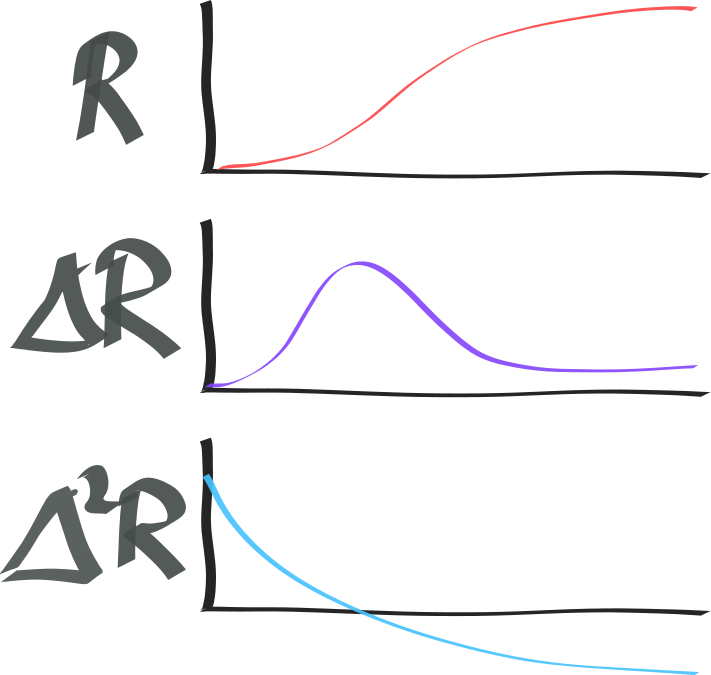

Imagine you want to make a twitter bot that is rewarded by likes (or more likely, to write papers that are rewarded by many citations). This is reinforcement learning as we have a non-differentiable incentive. But, there is some extra structure. Unlike the typical (markov sequence) setting, where __the__ reward is recieved after $n$ actions (for example at the completion of a game of Go). In this setting, we are told which action is responsible for the reward. The tweet that was liked, the paper that was cited (thus we don't need to assign credit to actions). But we have only received a partial view of the reward. Rather than revealing the true reward of your action, its expected return in the future, we only have access to the rewards recieved so far.

> (In contrast to pong) If I receive a reward of 0.7, because I won 7 out of 10 games of pong using policy $\pi$, then in the future I would expect to continue to receive a reward roughly equal 0.7 unless something changes (such as the opponent).
In this setting, receiving a reward of 0.7 at time step $t$ is not indicative of future rewards as your tweet/paper might be 'discovered' at some future time, $T$, and massively liked/cited.

## A deliberative oracle

We could think of this as:

> The oracle is testing/evaluating your action and gives you feedback based on its current imperfect knowledge.

How is this oracle structured? Some assumptions that seem helpful are;

- monotonic (in the case of likes and citiations, we could probably assume that, although it isnt quite true)
- Outputs deltas, $\Delta R$, not the absolute value of $R$. (thus must be integrated to find $R$)
- There is a time lag between the response of the oracle and the action taken (might be a different lag for different actions...)
- you can take actions now that influence the rewards recieved by past actions. For example, "please like tweet X". Or citing your own past work...

## Formal setting

<side>huh, there are no inputs. No observations. This doesn't seem important (?).</side>
At each time step, $t \in \mathbb Z^+$, you take an action $a^t \in A$ an recieve a reward $r^t \in \mathbb R^t$. The goal is to learn a poilcy $\pi$ that receives past actions and rewards that maximises $R^{\infty}$.

$$
a^t = \pi(a^{t-1:0}, r^{t-1:0}) \\
R^{\infty} = \sum_{i=0}^{\infty} \parallel r^i \parallel \\
$$

<side>Does thinking about rewards like this help in the markov sequence setting? Where we only get to observe the sum across columns, $\sum_{i=0}^t \textbf{R}^t_i$. $\textbf{Q:}$ How much faster can learning occur when we have access to this information?</side>
We can write the rewards received as a matrix by stacking them horizontally.

$$
\begin{align}
\textbf{R}^t &= \begin{bmatrix}
r_0^0 & r_0^1 & r_0^2 & r_0^3 \\
 & r_1^1 & r_1^2 & r_1^3 \\
 &  & r_2^2 & r_2^3 \\
 &  &  & r_3^3 \\
\end{bmatrix}\\
&= [\text{actions taken} \times \text{time steps}]
\end{align}
$$

Where $r^t_n$ denotes the reward for the $n$th action recived at time $t$.

Note the size of $\textbf{R}^t$. We can imagine a point where we have taken thousands of actions and are receiving feedback on all of them. We may want to integrate this recent feedback with past feedback, which would require $\mathcal O(n^2)$ operations.

So given a time step, how might the rewards be distributed over the past actions?

<side>Is there anything dangerous/pathological about doing this?</side>
The velocity ($\Delta R$) and acceleration ($\Delta^2 R$) appear to be useful signals. A simple heurstic could be to maximise them in place of the true $R$.

## Learning

Learning in this setting poses some interesting quirks:

- we __really__ want to pick actions that will be useful in the long term! Ones that continue to pay off or positively effect the reward of new actions!
- because the relationship between actions and short term rewards are easier to learn (there is more data) we would expect an agent's behaviour to be myopic. (how can this be avoided?)
- We need to distinguish between two cases; (1) shitty action, (2) payoff is still in the future. $\textbf{Q:}$ How should we update our policy if we believe an action has a large payoff coming, but has not yet recieved any reward?
- Exploration?
